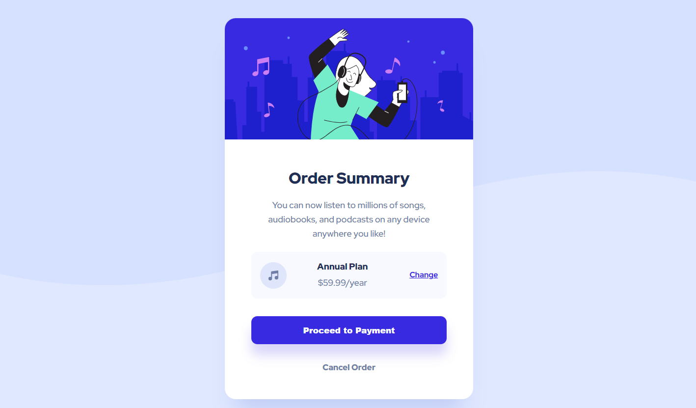

# Frontend Mentor - Order summary card solution

## Overview

This is a solution to the [Order summary card challenge on Frontend Mentor](https://www.frontendmentor.io/challenges/order-summary-component-QlPmajDUj).

### Screenshot

### Links

- Solution URL: [Solution URL here](https://github.com/Nuca29/Order-Summary-Component.git)
- Live Site URL: [Live site URL here](https://nuca29.github.io/Order-Summary-Component/)

### Built with

- Semantic HTML5 markup
- CSS custom properties
- Flexbox
- CSS Grid

### What I learned

Things I learned while working through this project:

1. CSS background properties, such as background-repeat and background-size.
2. Learned more about Flexbox, for example, how to use flex-direction, justify-content, align-items, etc.

### Continued development

I am not confident in using CSS background properties and would like to work on that in future projects.

### Useful resources

- [CSS Background Properties](https://www.freecodecamp.org/news/learn-css-background-properties/) - This is an amazing article about CSS background properties.
- [background-position](https://css-tricks.com/almanac/properties/b/background-position/) - This article help me a lot understand background-position property in CSS.
